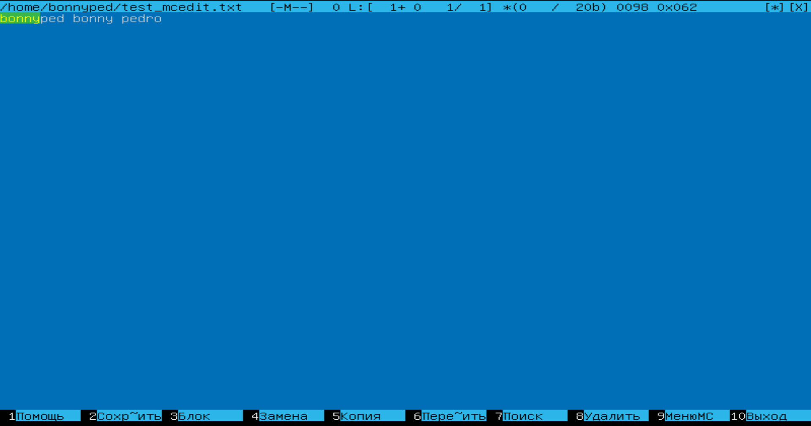
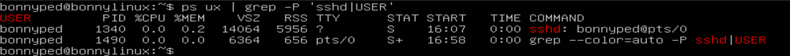
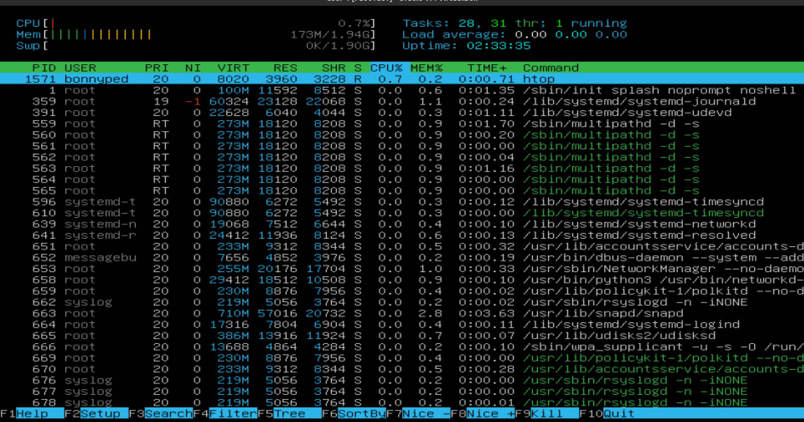

## Part I - Установка системы
___
1. На экране версия Убунту Сервер 20.04
  

## Part II - Создание пользователя
___
1. Команда для создания пользователя
  

2. Виден новый, добавленный мной пользователь

## Part III - Настройка сети ОС
___

+ задаю имя машины вида user-1
  
прежнее имя виртуальной машины

    
команда для смены имени машины (машина должна быть выключена)

новое виртуальной имя машины

прежнее имя машины

    
команда для смены имени машины

новое имя машины

+ задаю локальный часовой пояс
  

+ вывожу названия сетевых интерфэйсов

+ интерфейс lo присутствует на всех Unix системах, он применяется для тестирования служб, не подвергая их безопасность риску, т.к. не требует активного подключения к сети и выполняется локально.

+ Расшифровка DHCP - Dynamic Host Configuration Protocol или Протокол Динамической Конфигурации Хоста. 

+ Узнаю ip локальной сети адрес при помощи утилиты ip

+ Вывожу на экран внешний и внутренний IP адресы шлюза
+ первый способ 

  + второй способ, флаг U ознрачает маршрут вверх, а флаг G, что это шлюз (Gateway) 
  

+ Задаю статичные ip адрес, dns и gw

+ После перезапуска статичные сетевые настройки сохранены

+ успешный пинг публичных серверов 1.1.1.1 и ya.ru

+ Описание действий:
  1. изменил имя виртуальной машины на user-1, в основной ОС, при выключенной ВМ
  2. изменил имя hostname, изменив два файла /etc/hostname и /etc/hosts
  3. грепнул list-timezone запросом Novosibirsk, установил часовой пояс через set-timezones
  4. при помощи консольных команд посмотрел сетевые интерфэйсы и их ip адреса, вывел их на экран
  5. при помощи утилиты netplan установил статичный ip адрес, изменив настройки системного файла в /etc/netplan/, убрал автоматическое распределние dhcp4, сохранил и применил настройку, перезагрузил компухтер. Отпинговал, все ок.
   
## Part 4. Обновление ситсемы
___

+ Система обновлена, пакетов для обновления нет

## Part 5. Использование команды **sudo**
___

+ Sudo позволяет временно передавать администраторские права без передачи пароля суперпользователя

## Part 6. Установка и настройка службы времени
___

+ Вывод времени текущегоместоположения
  

+ Синхронизация времени установлена, вывод команды timedatectl show:

## Part 7. Установка и использование текстовых редакторов
___

+ все три редактора создают новый файл, если нет файла с таким именем в системе
+ VIM, выход с сохранением поддерживается в режиме управления - :wq!

+ NANO, кнтрл + Х далее подтвердить сохранение кнопкой У, далее подтвердить имя файла в котором сохраняем Ентер

+ MCEDIT, для выхода нужно просто нажать ESC, программа перед выходом предложит сохранить изменения и выйдет после выбора пользователя

+ VIM, выход без сохранения поддерживается в режиме управления - :q!

+ NANO, кнтрл + Х далее отменить сохранение кнопкой N, далее подтвердить имя файла в котором сохраняем Ентер

+ MCEDIT, для выхода нужно просто нажать ESC, программа перед выходом предложит сохранить изменения, нужно отказаться от сохраения

+ VIM, поиск вперед осуществляется при помощи косой черты / за которой следует указать паттерн, поиск назад то же самое, только с помощью знака ?, поиск и замена осуществляются при помощи команды :s/foo/bar, где foo - искомый паттерн, а bar - то на, что меняем

+ NANO, кнтрл + W, далее ввести слово, которое ищем, если нужнопродолжить поиск по слову далее по тексту, нужно нажать комбинацию вновь, поиск и замена слова осуществляется комбинацией кнтрл + \

+ MCEDIT, для поиска F7, для замены F4

## Part 8. Установка и базовая настройка сервиса **SSHD**
___
1. sudo apt install ssh
2. создал резервную копию заводских настроек файла /etc/ssh/sshd_config
3. изменил настройки файла в части порта, сменил с 22 на 2022, убрал Root доступ, установленный по умолчанию в качестве безопасности
4. Добавил службу в автозагрузку командой sudo systemctl enable ssh
5. Команда PS отображает запущенные процессы, для отображения процесса sshd использовал два ключа -aux, ключ -u отвечает за вывод идентификатора и/или имени пользователя, который использует процесс, ключ -а заставляет перечислить все процессы, которые запущены в TTY, ключ -х позволяет увидеть процессы, даже те у которых не определено значечние TTY. 

 6. Вывод команды netstat -tan после переpагрузки
  

 7. ключ -а покаазывает оба типа соединений и прослушивающие и не прослушыввающие, ключ -t отображает информацию только о протоколе TCP, ключ -n отоборажает цифровые адреса, вместо канонического имени
 8. значения столбцов:
    1. Proto - Наименование протокола
    2. Recv-Q - счетчик байт не скопированных программой пользователя
    3. Send-Q - счетчик байт, не подтвержденных удаленным узлом
    4. Локальный адрес и номер порта локального конца сокета
    5. Адрес и номер порта удаленного конца сокета
    6. Состояние сокета
 9. 0.0.0.0 это мета адрес, без конкретного адресатора, если находится в состоянии прослушивание на сервере, то будет доступен всем адресам хоста, на котором он запущен.

## Part 9. Установка и использование утилит **top**, **htop**
___
Определил по TOP:
1. Uptime - 1.59
2. Количество авторизованных пользователей - 1
3. Общая загрузка системы - 0.00 0.00 0.00
4. Общее кол-во процессов - 96
5. Загрузка CPU
  
6. агрузка памяти
  
7. pid процесса занимающего больше всего памяти - 1410
  
8. pid процесса, занимающего больше всего процессорного времени -359 
  
   
Вывод команды HTOP:
1. сортировка по PID
  

2. сортировка PERCENT_CPU 
  

3. сортировка по PERCENT_MEM 
  

4. сортировка по TIME
  

5. фильтр по sshd
  

6. скрин с процессом syslog найденным через поиск
  
      
1. с добавленным выводом hostname, clock и uptime
  
   
## Part 10. Использование утилиты **fdisk**
___
1. Название жесткого диска - /dev/sda 
2. Размер - 15 GB
3. Количество секторов - 31457280
4. Размер swap - 1,9 GB

## Part 11. Использование утилиты **df** 
___
- df для корневого раздела (/):
1. Размер раздела - 10218772
2. Размер занятого пространства - 4807612
3. Размер свободного пространства -  4870488
4. Процент использования - 50%

- df -Th для корневого раздела (/):
1. размер раздела - 9,8 GB
2. размер занятого пространства - 4,6 GB
3. размер свободного пространства - 4,7 GB
4. процент использовани - 50%
5. Тип файловой системы раздела - ext4 

## Part 12. Использование утилиты **du**
/home
  

/var
  

/var/log
  

/var/log с содержимым каждого файла
  

## Part 13. Установка и использование утилиты **ncdu**
___

/home
  

/var
  

/var/log
  

## Part 14. Работа с системными журналами
___
1. Последняя авторизация 26 ферваля 2023 16:07:10
2. Имя пользователя - bonnyped
3. Метод входа в систему - локальный
  

# Part 15. Использование планировщика заданий **CRON**
___
  + список задач
  

  + строчки о выполнении
  

  + удалил все задачи
  